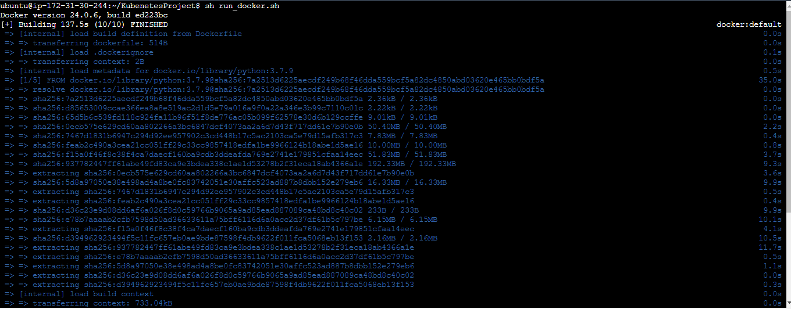
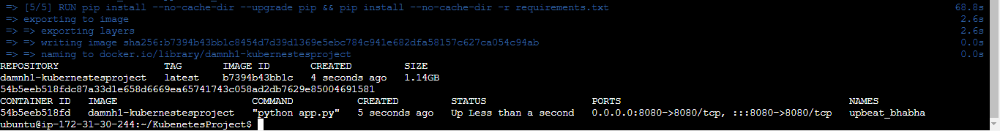
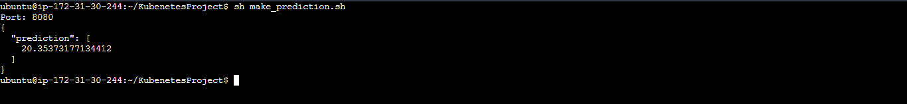
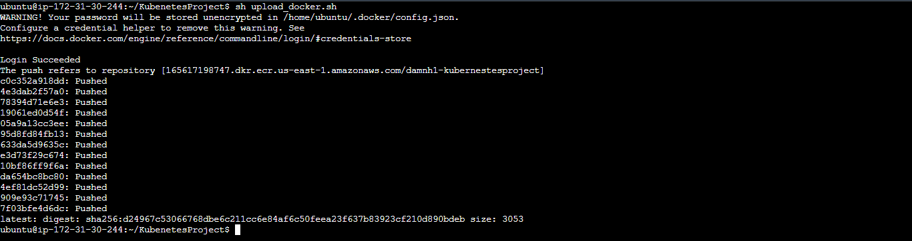
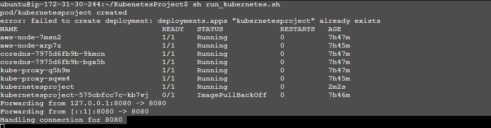

#### Get source
    git clone https://github.com/nguyenhuudamm/KubenetesProject.git

#### Install kubectl
    -- curl -LO https://storage.googleapis.com/kubernetes-release/release/`curl -s https://storage.googleapis.com/kubernetes-release/release/stable.txt`/bin/linux/amd64/kubectl
    -- which kubectl
    -- sudo mv kubectl /usr/local/bin/
    -- chmod +x /usr/local/bin/kubectl
    -- [CHECK]
        -- kubectl version --client
        -- kubectl version

#### Install eksctl
    -- curl --silent --location "https://github.com/weaveworks/eksctl/releases/latest/download/eksctl_$(uname -s)_amd64.tar.gz" | tar xz -C /tmp
    -- sudo mv /tmp/eksctl /usr/local/bin
    -- [CHECK]
        -- eksctl version

#### Install hadolint
    -- sudo wget -O /bin/hadolint https://github.com/hadolint/hadolint/releases/download/v1.16.3/hadolint-Linux-x86_64
    -- sudo chmod +x /bin/hadolint
    -- [CHECK]
        -- hadolint Dockerfile

#### Install Make
    -- sudo apt install make
    -- sudo apt install make-guile

    -- set mặc định là python3.9
        sudo update-alternatives --install /usr/bin/python3 python3 /usr/bin/python3.7 1

#### Install circle
    -- curl -fLSs https://circle.ci/cli | bash
    -- sudo !!
    -- cd /tmp
    -- wget https://github.com/CircleCI-Public/circleci-cli/releases/download/v0.1.28995/circleci-cli_0.1.28995_linux_amd64.tar.gz
    -- tar zxvf circleci-cli_0.1.28995_linux_amd64.tar.gz
    -- cd circleci-cli_0.1.28995_linux_amd64
    -- mv circleci ~/KubenetesProject
    -- [CHECK]
        -- ./circleci
        -- make validate-circleci

#### Create cluster
    -- Create
        -- eksctl create cluster --name kubernetesproject --region=us-east-1

    -- Cleanup
        -- eksctl delete cluster --name=kubernetesproject --region=us-east-1

    -- Get namespace
        -- kubectl get namespaces

    -- Get pods
        -- kubectl get pods
        -- [error] "No resources found"
            -- kubectl config set-context --current --namespace=<my-kube-system>
            -- kubectl get pods

#### Step by step - Project result

#### Check circle

#### Run docker

#### Run make_prediction.sh 

#### Output: log container

#### Upload docker

#### Create pod - Port Forward

#### Run make_prediction.sh 

#### Output: log pods

